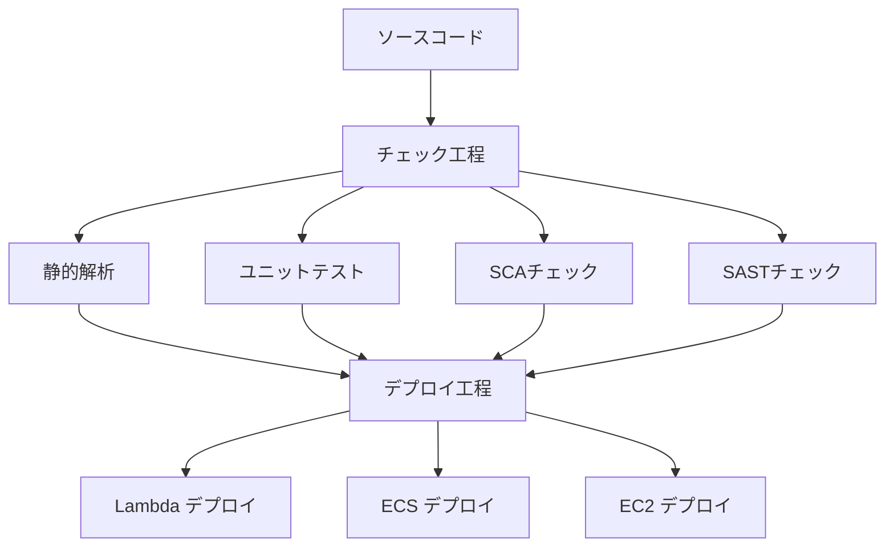

# CI/CDパイプラインプロジェクト

GitHub ActionsとAWS CodePipelineを使用してCI/CDパイプラインを構築するサンプルシステムです。

## 📋 目次

- [概要](#概要)
- [プロジェクト構造](#プロジェクト構造)
- [技術スタック](#技術スタック)
- [セットアップ](#セットアップ)
- [使用方法](#使用方法)
- [CI/CDパイプライン](#cicdパイプライン)
- [デプロイメント](#デプロイメント)
- [テスト](#テスト)
- [トラブルシューティング](#トラブルシューティング)
- [貢献](#貢献)
- [ライセンス](#ライセンス)

## 🎯 概要

このプロジェクトでは、PythonのFastAPIアプリケーションを3つの異なるAWSデプロイ先（Lambda、ECS、EC2）にデプロイし、CI/CDパイプラインの特徴を実証します。

### 🚀 デプロイ先

| デプロイ先 | デプロイ方式 | 特徴 |
|-----------|-------------|------|
| **AWS Lambda** | AWS SAM | サーバーレス、自動スケーリング |
| **Amazon ECS** | ECS Blue/Green | コンテナベース、高可用性 |
| **Amazon EC2** | CodeDeploy Blue/Green | 従来型、フルコントロール |

### 🔧 CI/CDツール

| ツール | 特徴 | 認証方式 |
|--------|------|----------|
| **GitHub Actions** | GitHubネイティブ、豊富なマーケットプレイス | OIDC |
| **AWS CodePipeline** | AWSネイティブ、統合開発環境 | IAM |

## プロジェクト構造

```
.
├── .github/
│   └── workflows/          # GitHub Actionsワークフロー
├── cdk/                    # AWS CDKインフラコード
├── modules/
│   └── api/                # FastAPI アプリケーション
├── cicd/                   # CodePipelineビルドスペック
└── docs/                   # ドキュメント
```

## 技術スタック

- **Python**: 3.13
- **Webフレームワーク**: FastAPI
- **パッケージ管理**: uv
- **インフラ**: AWS CDK (TypeScript)
- **コンテナ**: Docker
- **テスト**: pytest

## 🛠️ セットアップ

### 前提条件

以下のツールがインストールされている必要があります：

| ツール | バージョン | 用途 |
|--------|-----------|------|
| [asdf](https://asdf-vm.com/) | latest | ランタイムバージョン管理 |
| [uv](https://docs.astral.sh/uv/) | latest | Pythonパッケージ管理 |
| [AWS CLI](https://aws.amazon.com/cli/) | v2 | AWS操作 |
| [Docker](https://www.docker.com/) | latest | コンテナ化 |
| [Node.js](https://nodejs.org/) | 18+ | CDK用 |

### 🚀 クイックスタート

1. **リポジトリのクローン**

   ```bash
   git clone <repository-url>
   cd github-codepipeline-cicd
   ```

2. **ランタイムのインストール**

   ```bash
   asdf install
   ```

3. **Python依存関係のインストール**

   ```bash
   uv sync --dev
   ```

4. **CDK依存関係のインストール**

   ```bash
   cd cdk
   npm install
   cd ..
   ```

5. **開発サーバーの起動**

   ```bash
   cd modules/api
   uv run uvicorn main:app --reload --host 0.0.0.0 --port 8000
   ```

6. **APIの確認**
   - ヘルスチェック: <http://localhost:8000/health>
   - API文書: <http://localhost:8000/docs>
   - ReDoc: <http://localhost:8000/redoc>

## 📖 使用方法

### 💻 ローカル開発

```bash
# 開発サーバー起動
cd modules/api
uv run uvicorn main:app --reload

# テスト実行
uv run pytest

# 静的解析
uv run ruff check .
uv run black --check .

# カバレッジ付きテスト
uv run pytest --cov=modules/api --cov-report=html
```

### インフラストラクチャのデプロイ

```bash
cd cdk

# CDKのブートストラップ（初回のみ）
npx cdk bootstrap

# インフラのデプロイ
npx cdk deploy --all

# インフラの削除
npx cdk destroy --all
```

## 🔄 CI/CDパイプライン

各CI/CDツールで以下の工程を実行します：

### 📊 パイプライン構成



### ✅ チェック工程（並列実行）

| 工程 | ツール | 目的 |
|------|--------|------|
| **静的解析** | ruff, black | コード品質・フォーマット |
| **ユニットテスト** | pytest | 機能テスト・カバレッジ |
| **SCAチェック** | 各種ツール + CodeGuru Security | 依存関係脆弱性 |
| **SASTチェック** | 各種ツール + Inspector | ソースコード脆弱性 |

### 🚀 デプロイ工程（並列実行）

| デプロイ先 | 方式 | 特徴 |
|-----------|------|------|
| **AWS Lambda** | AWS SAM | サーバーレス、即座にスケール |
| **Amazon ECS** | Blue/Green | ゼロダウンタイム、ロールバック可能 |
| **Amazon EC2** | CodeDeploy Blue/Green | 従来型、詳細制御 |

## 🏗️ デプロイメント

### AWS Lambda

```bash
# SAMを使用したデプロイ
sam build
sam deploy --guided
```

### Amazon ECS

```bash
# Dockerイメージのビルドとプッシュ
docker build -t my-app .
docker tag my-app:latest <account-id>.dkr.ecr.<region>.amazonaws.com/my-app:latest
docker push <account-id>.dkr.ecr.<region>.amazonaws.com/my-app:latest

# ECSサービスの更新
aws ecs update-service --cluster my-cluster --service my-service --force-new-deployment
```

### Amazon EC2

```bash
# CodeDeployを使用したデプロイ
aws deploy create-deployment \
  --application-name my-app \
  --deployment-group-name my-deployment-group \
  --s3-location bucket=my-bucket,key=my-app.zip,bundleType=zip
```

## 🧪 テスト

### ユニットテスト

```bash
# 全テスト実行
uv run pytest

# 特定のテストマーカー実行
uv run pytest -m unit
uv run pytest -m integration
uv run pytest -m deployment

# カバレッジ付きテスト
uv run pytest --cov=modules/api --cov-report=html --cov-fail-under=80
```

## 🔧 トラブルシューティング

### よくある問題

#### 1. Python環境の問題

```bash
# uvの再インストール
curl -LsSf https://astral.sh/uv/install.sh | sh

# 仮想環境の再作成
uv venv --python 3.13
uv sync --dev
```

#### 2. AWS認証の問題

```bash
# AWS認証情報の確認
aws sts get-caller-identity

# プロファイルの設定
aws configure --profile my-profile
export AWS_PROFILE=my-profile
```

#### 3. Docker関連の問題

```bash
# Dockerデーモンの確認
docker info

# イメージの再ビルド
docker build --no-cache -t my-app .
```

#### 4. CDK関連の問題

```bash
# CDKの再インストール
npm install -g aws-cdk

# ブートストラップの確認
cdk bootstrap --show-template
```

### ログの確認

```bash
# アプリケーションログ
tail -f logs/app.log

# CloudWatchログ
aws logs tail /aws/lambda/my-function --follow

# ECSタスクログ
aws logs tail /ecs/my-service --follow
```

### デバッグモード

```bash
# FastAPIのデバッグモード
export DEBUG=true
uv run uvicorn main:app --reload --log-level debug

# pytestのデバッグ
uv run pytest -v -s --pdb
```

## 🤝 貢献

### 開発フロー

1. Issueの作成
2. フィーチャーブランチの作成
3. 実装とテスト
4. プルリクエストの作成
5. コードレビュー
6. マージ

### コミット規約

[Conventional Commits](https://www.conventionalcommits.org/ja/v1.0.0/)に従ってください：

```
feat: 新機能の追加
fix: バグ修正
docs: ドキュメントの更新
style: コードスタイルの修正
refactor: リファクタリング
test: テストの追加・修正
chore: その他の変更
```

### コードスタイル

```bash
# フォーマット
uv run black .
uv run ruff check --fix .

# 型チェック
uv run mypy modules/api
```

## 📚 参考資料

- [FastAPI Documentation](https://fastapi.tiangolo.com/)
- [AWS CDK Documentation](https://docs.aws.amazon.com/cdk/)
- [GitHub Actions Documentation](https://docs.github.com/actions)
- [AWS CodePipeline Documentation](https://docs.aws.amazon.com/codepipeline/)

## 📄 ライセンス

MIT License - 詳細は [LICENSE](LICENSE) ファイルを参照してください。
