# CI/CDパイプライン比較プロジェクト

GitHub ActionsとGitLab CI/CDの2つのCI/CDツールでパイプラインを構築し、それぞれの書き方と挙動の違いを比較するためのサンプルシステムです。

## 📋 目次

- [概要](#概要)
- [プロジェクト構造](#プロジェクト構造)
- [技術スタック](#技術スタック)
- [セットアップ](#セットアップ)
- [使用方法](#使用方法)
- [CI/CDパイプライン](#cicdパイプライン)
- [デプロイメント](#デプロイメント)
- [テスト](#テスト)
- [ローカル開発](#ローカル開発)
- [ローカルテスト環境](#ローカルテスト環境)
- [トラブルシューティング](#トラブルシューティング)
- [貢献](#貢献)
- [ライセンス](#ライセンス)

## 🎯 概要

このプロジェクトでは、PythonのFastAPIアプリケーションを3つの異なるAWSデプロイ先（Lambda、ECS、EC2）にデプロイし、各CI/CDツールの特徴を実証します。

### 🚀 デプロイ先

| デプロイ先 | デプロイ方式 | 特徴 |
|-----------|-------------|------|
| **AWS Lambda** | AWS SAM | サーバーレス、自動スケーリング |
| **Amazon ECS** | ECS Blue/Green | コンテナベース、高可用性 |
| **Amazon EC2** | CodeDeploy Blue/Green | 従来型、フルコントロール |

### 🔧 CI/CDツール

| ツール | 特徴 | 認証方式 |
|--------|------|----------|
| **GitHub Actions** | GitHubネイティブ、豊富なマーケットプレイス | OIDC |
| **GitLab CI/CD** | GitLabネイティブ、統合開発環境 | 変数管理 |

## プロジェクト構造

```
.
├── .github/
│   └── workflows/          # GitHub Actionsワークフロー
├── .gitlab-ci.yml          # GitLab CI/CDパイプライン設定
├── gitlab/
│   ├── scripts/            # GitLab CI/CD用スクリプト
│   └── templates/          # GitLab CI/CDテンプレート
├── cdk/                    # AWS CDKインフラコード
├── modules/
│   └── api/                # FastAPI アプリケーション
├── cicd/           # 削除済み（CodePipelineアプローチは廃止）
└── docs/                   # ドキュメント
```

## 技術スタック

- **Python**: 3.13
- **Webフレームワーク**: FastAPI
- **パッケージ管理**: uv
- **インフラ**: AWS CDK (TypeScript)
- **コンテナ**: Docker
- **テスト**: pytest

## 🛠️ セットアップ

### 前提条件

以下のツールがインストールされている必要があります：

| ツール | バージョン | 用途 |
|--------|-----------|------|
| [asdf](https://asdf-vm.com/) | latest | ランタイムバージョン管理 |
| [uv](https://docs.astral.sh/uv/) | latest | Pythonパッケージ管理 |
| [AWS CLI](https://aws.amazon.com/cli/) | v2 | AWS操作 |
| [Docker](https://www.docker.com/) | latest | コンテナ化 |
| [Node.js](https://nodejs.org/) | 18+ | CDK用 |

### 🚀 クイックスタート

1. **リポジトリのクローン**

   ```bash
   git clone <repository-url>
   cd github-gitlab-codepipeline
   ```

2. **ランタイムのインストール**

   ```bash
   asdf install
   ```

3. **Python依存関係のインストール**

   ```bash
   uv sync --dev
   ```

4. **CDK依存関係のインストール**

   ```bash
   cd cdk
   npm install
   cd ..
   ```

5. **開発サーバーの起動**

   ```bash
   cd modules/api
   uv run uvicorn main:app --reload --host 0.0.0.0 --port 8000
   ```

6. **APIの確認**
   - ヘルスチェック: <http://localhost:8000/health>
   - API文書: <http://localhost:8000/docs>
   - ReDoc: <http://localhost:8000/redoc>

## 📖 使用方法

### 🎯 CI/CDツール比較の実行

このプロジェクトの主目的である2つのCI/CDツールの比較を実行する手順：

#### 1. インフラストラクチャのデプロイ

CDKデプロイで使用するプロファイルは必ず`private`にしてください
CDKデプロイ時のリージョンは、必ず`ap-northeast-1`にしてください


```bash
cd cdk
npx cdk deploy --all --profile private --region ap-northeast-1 --require-approval never --progress events
```

これにより、各CI/CDツール専用のAWSリソースが作成されます：

| ツール | リソース命名 | エンドポイント |
|--------|-------------|---------------|
| GitHub Actions | `github-local-*` | Port 8080 |
| GitLab CI/CD | `gitlab-local-*` | Port 8081 |

#### 2. CI/CDパイプラインの実行

各ツールでパイプラインを実行し、同時実行での動作を確認：

```bash
# GitHub Actions（プッシュまたは手動実行）
git push origin main

# GitLab CI/CD（GitLabでプッシュまたは手動実行）
# GitLabリポジトリにプッシュ
```

#### 3. CI/CDツール比較テストの実行

専用のMakefileを使用して包括的な比較テストを実行：

```bash
# 全ての比較テストを実行
make -f Makefile.cicd-comparison compare-all

# 個別のテスト実行
make -f Makefile.cicd-comparison test-endpoints      # エンドポイントアクセステスト
make -f Makefile.cicd-comparison test-performance    # パフォーマンス比較テスト
make -f Makefile.cicd-comparison test-failures       # パイプライン失敗条件テスト
make -f Makefile.cicd-comparison collect-metrics     # メトリクス収集
```

#### 4. エンドポイントアクセステスト

各CI/CDツール専用のエンドポイントにアクセスして動作確認：

```bash
# GitHub Actions専用エンドポイント（Port 8080）
curl https://github-local-alb-api:8080/health
curl https://github-local-alb-api:8080/api/items

# GitLab CI/CD専用エンドポイント（Port 8081）
curl https://gitlab-local-alb-api:8081/health
curl https://gitlab-local-alb-api:8081/api/items
```

#### 5. パフォーマンス比較分析

```bash
# パフォーマンス比較レポート生成
make -f Makefile.cicd-comparison performance-report

# 個別ツールのパフォーマンス測定
python scripts/cicd-performance-comparison.py --tools github gitlab codepipeline

# メトリクス収集（環境変数設定が必要）
export GITHUB_REPO="owner/repository"
export GITLAB_PROJECT_ID="12345"
python scripts/collect-cicd-metrics.py --days 7 --include-deployments
```

#### 6. 失敗条件テスト

各CI/CDツールが適切に失敗を検出・処理することを確認：

```bash
# 全ての失敗条件テスト
make -f Makefile.cicd-comparison test-failures

# 特定の失敗条件テスト
make -f Makefile.cicd-comparison test-lint-failures    # 静的解析失敗
make -f Makefile.cicd-comparison test-unit-failures    # ユニットテスト失敗
make -f Makefile.cicd-comparison test-sca-failures     # SCA失敗
make -f Makefile.cicd-comparison test-sast-failures    # SAST失敗
```

### 💻 ローカル開発

```bash
# 開発サーバー起動
cd modules/api
uv run uvicorn main:app --reload

# テスト実行
uv run pytest

# 静的解析
uv run ruff check .
uv run black --check .

# カバレッジ付きテスト
uv run pytest --cov=modules/api --cov-report=html
```

### インフラストラクチャのデプロイ

```bash
cd cdk

# CDKのブートストラップ（初回のみ）
npx cdk bootstrap

# インフラのデプロイ
npx cdk deploy --all

# インフラの削除
npx cdk destroy --all
```

## 🔄 CI/CDパイプライン

各CI/CDツールで以下の工程を実行します：

### 📊 パイプライン構成



### ✅ チェック工程（並列実行）

| 工程 | ツール | 目的 |
|------|--------|------|
| **静的解析** | ruff, black | コード品質・フォーマット |
| **ユニットテスト** | pytest | 機能テスト・カバレッジ |
| **SCAチェック** | 各種ツール + CodeGuru Security | 依存関係脆弱性 |
| **SASTチェック** | 各種ツール + Inspector | ソースコード脆弱性 |

### 🚀 デプロイ工程（並列実行）

| デプロイ先 | 方式 | 特徴 |
|-----------|------|------|
| **AWS Lambda** | AWS SAM | サーバーレス、即座にスケール |
| **Amazon ECS** | Blue/Green | ゼロダウンタイム、ロールバック可能 |
| **Amazon EC2** | CodeDeploy Blue/Green | 従来型、詳細制御 |

## 🏗️ デプロイメント

### AWS Lambda

```bash
# SAMを使用したデプロイ
sam build
sam deploy --guided
```

### Amazon ECS

```bash
# Dockerイメージのビルドとプッシュ
docker build -t my-app .
docker tag my-app:latest <account-id>.dkr.ecr.<region>.amazonaws.com/my-app:latest
docker push <account-id>.dkr.ecr.<region>.amazonaws.com/my-app:latest

# ECSサービスの更新
aws ecs update-service --cluster my-cluster --service my-service --force-new-deployment
```

### Amazon EC2

```bash
# CodeDeployを使用したデプロイ
aws deploy create-deployment \
  --application-name my-app \
  --deployment-group-name my-deployment-group \
  --s3-location bucket=my-bucket,key=my-app.zip,bundleType=zip
```

## 🧪 テスト

### ユニットテスト

```bash
# 全テスト実行
uv run pytest

# 特定のテストマーカー実行
uv run pytest -m unit
uv run pytest -m integration
uv run pytest -m deployment
uv run pytest -m pipeline_failure

# カバレッジ付きテスト
uv run pytest --cov=modules/api --cov-report=html --cov-fail-under=80
```

### 統合テスト（CI/CDツール比較）

```bash
# CI/CDツール比較専用テストの実行
uv run pytest modules/api/tests/test_cicd_tool_comparison.py -v

# エンドポイントアクセステスト
uv run pytest modules/api/tests/test_cicd_tool_comparison.py::TestCICDToolEndpointComparison -v

# パフォーマンス比較テスト
uv run pytest modules/api/tests/test_cicd_tool_comparison.py::TestCICDToolPerformanceComparison -v

# 各ツール専用テスト
uv run pytest modules/api/tests/test_cicd_tool_comparison.py -k "github" -v
uv run pytest modules/api/tests/test_cicd_tool_comparison.py -k "gitlab" -v
```

### CI/CD比較分析

```bash
# パイプライン失敗条件テスト
uv run pytest modules/api/tests/test_pipeline_failure_conditions.py -v

# 失敗検出速度測定
uv run pytest modules/api/tests/test_pipeline_failure_conditions.py::TestPipelinePerformanceUnderFailure -v

# 失敗回復テスト
uv run pytest modules/api/tests/test_pipeline_failure_conditions.py::TestPipelineFailureRecovery -v
```

### パフォーマンステスト

```bash
# パフォーマンス比較レポート生成
python scripts/cicd-performance-comparison.py --tools github gitlab codepipeline --measure-deployment

# メトリクス収集
python scripts/collect-cicd-metrics.py --tools github gitlab codepipeline --days 7 --include-deployments

# レスポンス時間測定
uv run pytest modules/api/tests/test_cicd_tool_comparison.py::TestCICDToolPerformanceComparison::test_endpoint_response_time -v -s
```

## 💻 ローカル開発

### GitHub Actions

```bash
# actツールのインストール
brew install act

# ワークフローの実行
act

# 特定のジョブの実行
act -j test

# 設定ファイルの使用
act --actrc .actrc
```

### GitLab CI/CD

```bash
# GitLab Runnerのインストール
brew install gitlab-runner

# ローカル実行
gitlab-runner exec docker test

# 設定ファイルの使用
gitlab-runner --config .gitlab-runner/config.toml exec docker test
```

### AWS CodePipeline

```bash
# CodeBuildのローカル実行
# https://docs.aws.amazon.com/codebuild/latest/userguide/use-codebuild-agent.html

# buildspecの検証
aws codebuild batch-get-projects --names my-project
```

## 🔧 トラブルシューティング

### よくある問題

#### 1. Python環境の問題

```bash
# uvの再インストール
curl -LsSf https://astral.sh/uv/install.sh | sh

# 仮想環境の再作成
uv venv --python 3.13
uv sync --dev
```

#### 2. AWS認証の問題

```bash
# AWS認証情報の確認
aws sts get-caller-identity

# プロファイルの設定
aws configure --profile my-profile
export AWS_PROFILE=my-profile
```

#### 3. Docker関連の問題

```bash
# Dockerデーモンの確認
docker info

# イメージの再ビルド
docker build --no-cache -t my-app .
```

#### 4. CDK関連の問題

```bash
# CDKの再インストール
npm install -g aws-cdk

# ブートストラップの確認
cdk bootstrap --show-template
```

### ログの確認

```bash
# アプリケーションログ
tail -f logs/app.log

# CloudWatchログ
aws logs tail /aws/lambda/my-function --follow

# ECSタスクログ
aws logs tail /ecs/my-service --follow
```

### デバッグモード

```bash
# FastAPIのデバッグモード
export DEBUG=true
uv run uvicorn main:app --reload --log-level debug

# pytestのデバッグ
uv run pytest -v -s --pdb
```

## 🤝 貢献

### 開発フロー

1. Issueの作成
2. フィーチャーブランチの作成
3. 実装とテスト
4. プルリクエストの作成
5. コードレビュー
6. マージ

### コミット規約

[Conventional Commits](https://www.conventionalcommits.org/ja/v1.0.0/)に従ってください：

```
feat: 新機能の追加
fix: バグ修正
docs: ドキュメントの更新
style: コードスタイルの修正
refactor: リファクタリング
test: テストの追加・修正
chore: その他の変更
```

### コードスタイル

```bash
# フォーマット
uv run black .
uv run ruff check --fix .

# 型チェック
uv run mypy modules/api
```

## 📚 参考資料

- [FastAPI Documentation](https://fastapi.tiangolo.com/)
- [AWS CDK Documentation](https://docs.aws.amazon.com/cdk/)
- [GitHub Actions Documentation](https://docs.github.com/actions)
- [GitLab CI/CD Documentation](https://docs.gitlab.com/ee/ci/)

## 📄 ライセンス

MIT License - 詳細は [LICENSE](LICENSE) ファイルを参照してください。

## 🧪 ローカルテスト環境

このプロジェクトでは、LocalStack、act、gitlab-ci-localを使用して、3つのCI/CDツールをローカル環境でテストできます。

### 📋 前提条件

#### 必須ツール

- **Docker & Docker Compose**: コンテナ実行環境
- **AWS CLI**: AWSサービス操作
- **jq**: JSON処理
- **uv**: Pythonパッケージ管理
- **asdf**: ランタイムバージョン管理

#### オプションツール（各CI/CDツール用）

- **act**: GitHub Actionsローカル実行

  ```bash
  # macOS
  brew install act
  
  # Linux
  curl https://raw.githubusercontent.com/nektos/act/master/install.sh | sudo bash
  ```

- **gitlab-ci-local**: GitLab CI/CDローカル実行

  ```bash
  npm install -g gitlab-ci-local
  ```

### 🚀 LocalStack環境のセットアップ

#### 1. LocalStackの起動

```bash
# LocalStackサービスを起動
make -f Makefile.localstack localstack-start

# または手動で起動
docker-compose -f docker-compose.localstack.yml up -d
```

#### 2. LocalStack初期化

```bash
# AWSリソースを初期化
make -f Makefile.localstack localstack-init

# LocalStackの状態確認
make -f Makefile.localstack localstack-status
```

#### 3. LocalStack接続テスト

```bash
# 接続テスト
make -f Makefile.localstack localstack-test

# 利用可能なリソース確認
source scripts/localstack-helpers.sh
setup_localstack_env
list_localstack_resources
```

### 🔧 各CI/CDツールのローカルテスト

#### GitHub Actions (act)

```bash
# GitHub Actionsワークフローをローカルでテスト
./scripts/test-github-actions-local.sh

# 特定のジョブのみテスト
./scripts/test-github-actions-local.sh -j lint

# 利用可能なワークフロー確認
./scripts/test-github-actions-local.sh --list

# ドライランのみ実行
./scripts/test-github-actions-local.sh --dry-run
```

**actの設定ファイル (.actrc)**:

```
--env-file .env.localstack
--platform ubuntu-latest=catthehacker/ubuntu:act-latest
--container-architecture linux/amd64
--verbose
```

#### GitLab CI/CD (gitlab-ci-local)

```bash
# GitLab CI/CDパイプラインをローカルでテスト
./scripts/test-gitlab-ci-local.sh

# 特定のステージのみテスト
./scripts/test-gitlab-ci-local.sh -s check

# 特定のジョブのみテスト
./scripts/test-gitlab-ci-local.sh -j lint

# 設定の検証のみ
./scripts/test-gitlab-ci-local.sh --validate
```

#### CodePipeline (buildspec simulation)

```bash
# CodePipelineのbuildspecをローカルでテスト
./scripts/test-codepipeline-local.sh

# 特定のbuildspecのみテスト
./scripts/test-codepipeline-local.sh -b lint

# 利用可能なbuildspec確認
./scripts/test-codepipeline-local.sh --list
```

### 🔄 統合テスト

全てのCI/CDツールを一括でテストする統合テストスクリプト:

```bash
# 全CI/CDツールの統合テスト
./scripts/local-test-integration.sh

# 特定のツールのみテスト
./scripts/local-test-integration.sh --github-only
./scripts/local-test-integration.sh --gitlab-only
./scripts/local-test-integration.sh --codepipeline-only

# LocalStackを起動せずにテスト（既に起動済みの場合）
./scripts/local-test-integration.sh --no-localstack
```

### 🎯 環境名による条件分岐

ローカル環境では、実際のAWSサービスが利用できない機能は自動的にスキップされます：

#### スキップされる機能

| 機能 | GitHub Actions | GitLab CI/CD | CodePipeline |
|------|----------------|--------------|--------------|
| **CodeGuru Security** | ✅ スキップ | ✅ スキップ | ✅ スキップ |
| **CodeQL** | ✅ スキップ | - | - |
| **Dependabot** | ✅ スキップ | - | - |
| **GitLab SAST** | - | ❌ 実行 | - |
| **GitLab Dependency Scanning** | - | ❌ 実行 | - |

#### 環境判定ロジック

- **GitHub Actions**: `act`実行時に自動判定
- **GitLab CI/CD**: `CI_PIPELINE_SOURCE=gitlab-ci-local`で判定
- **CodePipeline**: `STAGE_NAME=local`で判定

### 📊 テスト結果の確認

#### テストレポート

統合テストを実行すると、`local-test-report.md`が生成されます：

```bash
# テストレポート確認
cat local-test-report.md
```

#### LocalStackリソース確認

```bash
# LocalStackのリソース状況確認
source scripts/localstack-helpers.sh
setup_localstack_env
show_localstack_status
list_localstack_resources
```

#### ログ確認

```bash
# LocalStackログ確認
make -f Makefile.localstack localstack-logs

# 特定のサービスのログ確認
docker logs localstack-cicd-comparison
```

### 🛠️ トラブルシューティング

#### よくある問題と解決方法

1. **LocalStackが起動しない**

   ```bash
   # Dockerサービス確認
   docker ps
   
   # ポート競合確認
   lsof -i :4566
   
   # LocalStack再起動
   make -f Makefile.localstack localstack-restart
   ```

2. **actでGitHub Actionsが失敗する**

   ```bash
   # 詳細ログで実行
   act -j lint --verbose
   
   # 特定のプラットフォームで実行
   act -j lint --platform ubuntu-latest=catthehacker/ubuntu:act-latest
   ```

3. **gitlab-ci-localで設定エラー**

   ```bash
   # 設定検証
   gitlab-ci-local --list
   
   # 詳細ログで実行
   gitlab-ci-local --stage check --verbose
   ```

4. **AWS認証エラー**

   ```bash
   # LocalStack用認証情報設定
   export AWS_ACCESS_KEY_ID=test
   export AWS_SECRET_ACCESS_KEY=test
   export AWS_ENDPOINT_URL=http://localhost:4566
   ```

#### パフォーマンス最適化

1. **Dockerイメージキャッシュ**

   ```bash
   # 不要なイメージ削除
   docker system prune -f
   
   # LocalStackデータクリーンアップ
   make -f Makefile.localstack localstack-clean
   ```

2. **並列実行制限**

   ```bash
   # 同時実行数を制限（リソース不足時）
   act -j lint --parallel=1
   gitlab-ci-local --stage check --parallel=1
   ```

### 📈 ローカルテストのメリット

1. **高速フィードバック**: クラウド環境より高速
2. **コスト削減**: AWSリソース使用料不要
3. **オフライン開発**: インターネット接続不要
4. **デバッグ容易**: ローカル環境でのデバッグ
5. **実験安全**: 本番環境への影響なし

### 🔄 実環境との違い

| 項目 | ローカル環境 | 実環境 |
|------|-------------|--------|
| **AWS認証** | テスト認証情報 | 実際のIAM認証 |
| **セキュリティスキャン** | 一部スキップ | 全機能実行 |
| **デプロイ先** | LocalStack | 実際のAWSサービス |
| **ネットワーク** | ローカルネットワーク | AWSネットワーク |
| **パフォーマンス** | ローカルマシン依存 | AWSインフラ性能 |

### 📝 次のステップ

1. **ローカルテスト完了後**: 実環境（dev/staging）でのテスト
2. **設定調整**: 実環境用の設定ファイル更新
3. **パフォーマンス比較**: ローカルと実環境の実行時間比較
4. **CI/CD最適化**: テスト結果を基にした設定最適化

---

**注意**: ローカルテスト環境は開発・検証用途です。本番デプロイ前には必ず実環境でのテストを実施してください。
