# CI/CDツール比較分析・トラブルシューティングガイド

このドキュメントでは、GitHub Actions、GitLab CI/CD、AWS CodePipelineの比較結果の解釈方法と、各ツールで発生する可能性のある問題のトラブルシューティング方法について説明します。

## 📋 目次

- [比較分析の概要](#比較分析の概要)
- [パフォーマンス比較の解釈](#パフォーマンス比較の解釈)
- [設定複雑さの比較](#設定複雑さの比較)
- [機能比較の解釈](#機能比較の解釈)
- [コスト比較](#コスト比較)
- [トラブルシューティング](#トラブルシューティング)
- [ベストプラクティス](#ベストプラクティス)

## 🎯 比較分析の概要

### 分析対象

このプロジェクトでは以下の観点から3つのCI/CDツールを比較します：

| 比較観点 | 測定方法 | 重要度 |
|----------|----------|--------|
| **実行時間** | パイプライン開始から完了まで | 高 |
| **設定複雑さ** | YAML行数、ノード数、機能数 | 中 |
| **機能豊富さ** | 利用可能な機能の数と種類 | 中 |
| **AWS統合** | AWSサービスとの連携の容易さ | 高 |
| **コスト** | 実行コストと運用コスト | 高 |
| **学習コストの低さ** | 習得の容易さ | 中 |

### 比較結果の取得方法

```bash
# 統合テストの実行
./scripts/run-integration-tests.sh

# 設定ファイル複雑さ分析
python scripts/analyze-cicd-configs.py --format both

# パフォーマンス測定
python scripts/cicd-performance-comparison.py --collect-metrics

# 比較レポートの確認
cat docs/cicd-config-comparison.md
cat docs/cicd-performance-report.md
```

## ⚡ パフォーマンス比較の解釈

### 実行時間の測定

各CI/CDツールの実行時間は以下の要素で構成されます：

```mermaid
gantt
    title CI/CDパイプライン実行時間の内訳
    dateFormat X
    axisFormat %M:%S

    section GitHub Actions
    キューイング時間    :0, 30
    チェック工程       :30, 180
    デプロイ工程       :180, 300

    section GitLab CI/CD  
    キューイング時間    :0, 15
    チェック工程       :15, 150
    デプロイ工程       :150, 280

    section CodePipeline
    キューイング時間    :0, 45
    チェック工程       :45, 200
    デプロイ工程       :200, 350
```



#### 実行時間の解釈

**1. 全体実行時間**

```bash
# パフォーマンス測定結果の例
GitHub Actions: 4分30秒
GitLab CI/CD:   4分10秒  
CodePipeline:   5分45秒
```

**解釈ポイント**:

- **GitLab CI/CD**: 通常最も高速（専用Runnerの場合）
- **GitHub Actions**: 中程度（共有Runnerの待機時間に依存）
- **CodePipeline**: 最も時間がかかる（AWSサービス間の連携オーバーヘッド）

**2. 並列実行効率**

```bash
# 並列ジョブ数の比較
GitHub Actions: 4並列（lint, test, sca, sast）
GitLab CI/CD:   4並列（同上）
CodePipeline:   4並列（CodeBuildプロジェクト）
```

**解釈ポイント**:

- 並列度は同等だが、実際の並列実行効率は環境に依存
- GitHub Actions: 共有Runnerの場合、並列度に制限あり
- GitLab CI/CD: 専用Runnerの場合、最も効率的
- CodePipeline: AWSリソースの制限内で並列実行

**3. キャッシュ効率**

```bash
# キャッシュヒット率の測定例
GitHub Actions: 85% (actions/cache)
GitLab CI/CD:   90% (GitLab Cache)
CodePipeline:   75% (CodeBuild Cache)
```

**解釈ポイント**:

- GitLab CI/CD: 最も効率的なキャッシュ機能
- GitHub Actions: 豊富なキャッシュアクション
- CodePipeline: S3ベースのキャッシュ、設定が複雑

### パフォーマンス最適化の推奨事項

#### GitHub Actions

```yaml
# 最適化例
jobs:
  test:
    runs-on: ubuntu-latest
    strategy:
      matrix:
        python-version: [3.13]  # 単一バージョンで高速化
    steps:
      - uses: actions/cache@v3  # 積極的なキャッシュ利用
        with:
          path: ~/.cache/pip
          key: ${{ runner.os }}-pip-${{ hashFiles('**/requirements.txt') }}
```

#### GitLab CI/CD

```yaml
# 最適化例
cache:
  key: ${CI_COMMIT_REF_SLUG}
  paths:
    - .cache/pip
    - node_modules/
  policy: pull-push  # 効率的なキャッシュ戦略

test:
  stage: test
  image: python:3.13-slim  # 軽量イメージ使用
  before_script:
    - pip install --cache-dir .cache/pip -r requirements.txt
```

#### CodePipeline

```yaml
# buildspec.yml最適化例
version: 0.2
phases:
  install:
    runtime-versions:
      python: 3.13
  pre_build:
    commands:
      - pip install --upgrade pip
  build:
    commands:
      - pytest
cache:
  paths:
    - '/root/.cache/pip/**/*'  # 効果的なキャッシュパス
```

## 📊 設定複雑さの比較

### 複雑さメトリクス

設定ファイル分析スクリプトが出力する複雑さスコアの解釈：

```bash
# 分析結果例
GitHub Actions: 複雑さスコア 45.2
GitLab CI/CD:   複雑さスコア 38.7
CodePipeline:   複雑さスコア 62.1
```

#### スコア計算式

```python
complexity_score = (
    code_lines * 0.1 +           # コード行数
    yaml_nodes * 0.2 +           # YAMLノード数  
    job_count * 2.0 +            # ジョブ数
    step_count * 0.5 +           # ステップ数
    feature_count * 1.0          # 機能数
) * parallel_factor              # 並列度調整
```

#### 複雑さの解釈

**低複雑さ (< 40)**:

- 設定が簡潔で理解しやすい
- 保守性が高い
- 学習コストが低い

**中複雑さ (40-60)**:

- 適度な機能性と複雑さのバランス
- 一般的なプロジェクトに適している
- 中級者向け

**高複雑さ (> 60)**:

- 豊富な機能を持つが設定が複雑
- 高度なカスタマイズが可能
- 上級者向け、学習コストが高い

### 設定ファイル比較

#### 記述量比較

```bash
# 行数比較例
GitHub Actions (.github/workflows/ci.yml): 156行
GitLab CI/CD (.gitlab-ci.yml):             142行
CodePipeline (buildspecs/*.yml):           203行（合計）
```

**解釈**:

- GitLab CI/CD: 最も簡潔な記述
- GitHub Actions: 中程度の記述量
- CodePipeline: 最も詳細な設定が必要（複数ファイル）

#### 機能密度

```bash
# 機能数/行数の比較
GitHub Actions: 0.32 (50機能/156行)
GitLab CI/CD:   0.35 (50機能/142行)  
CodePipeline:   0.25 (50機能/203行)
```

**解釈**:

- GitLab CI/CD: 最も効率的な記述
- GitHub Actions: バランスの取れた記述
- CodePipeline: 冗長な記述が必要

## 🔧 機能比較の解釈

### 機能マトリックス

| 機能 | GitHub Actions | GitLab CI/CD | CodePipeline |
|------|----------------|--------------|--------------|
| **キャッシュ** | ✅ actions/cache | ✅ ネイティブ | ✅ S3ベース |
| **並列実行** | ✅ matrix戦略 | ✅ ステージベース | ✅ 並列アクション |
| **条件実行** | ✅ if条件 | ✅ rules/only/except | ✅ 条件アクション |
| **シークレット管理** | ✅ GitHub Secrets | ✅ CI/CD変数 | ✅ Parameter Store |
| **アーティファクト** | ✅ actions/upload | ✅ artifacts | ✅ S3出力 |
| **環境デプロイ** | ✅ environments | ✅ environments | ✅ ステージング |
| **承認フロー** | ✅ required reviewers | ✅ manual jobs | ✅ 手動承認 |
| **スケジュール実行** | ✅ cron | ✅ schedules | ✅ CloudWatch Events |

### AWS統合の比較

#### 認証方式

```bash
# GitHub Actions (OIDC推奨)
- uses: aws-actions/configure-aws-credentials@v4
  with:
    role-to-assume: arn:aws:iam::123456789012:role/github-actions-role
    aws-region: ap-northeast-1

# GitLab CI/CD (変数ベース)
variables:
  AWS_ACCESS_KEY_ID: $AWS_ACCESS_KEY_ID
  AWS_SECRET_ACCESS_KEY: $AWS_SECRET_ACCESS_KEY

# CodePipeline (IAMロール)
# 自動的にサービスロールを使用
```

**セキュリティ評価**:

1. **CodePipeline**: 最もセキュア（IAMロールベース）
2. **GitHub Actions**: セキュア（OIDC使用時）
3. **GitLab CI/CD**: 注意が必要（長期認証情報）

#### AWSサービス統合

```bash
# 統合の容易さ（5段階評価）
CodePipeline: 5/5 (ネイティブ統合)
GitHub Actions: 4/5 (公式アクション豊富)
GitLab CI/CD: 3/5 (AWS CLIベース)
```

## 💰 コスト比較

### 実行コスト

#### GitHub Actions

```bash
# 料金計算例（月間1000回実行）
実行時間: 4.5分/回 × 1000回 = 4500分
料金: 4500分 × $0.008/分 = $36/月
```

#### GitLab CI/CD

```bash
# GitLab.com共有Runner使用時
実行時間: 4.2分/回 × 1000回 = 4200分  
料金: 4200分 × $0.005/分 = $21/月

# セルフホストRunner使用時
EC2コスト: t3.medium × 24時間 × 30日 = $37/月
```

#### CodePipeline

```bash
# CodePipeline + CodeBuild料金
パイプライン: $1/月（アクティブパイプライン）
CodeBuild: 5.8分/回 × 1000回 × $0.005/分 = $29/月
合計: $30/月
```

**コスト効率**:

1. **GitLab CI/CD**: 最も安価（共有Runner使用時）
2. **CodePipeline**: 中程度（予測可能な料金）
3. **GitHub Actions**: 最も高価（プライベートリポジトリ）

### 運用コスト

| 項目 | GitHub Actions | GitLab CI/CD | CodePipeline |
|------|----------------|--------------|--------------|
| **学習コスト** | 中 | 低 | 高 |
| **保守コスト** | 低 | 低 | 中 |
| **監視コスト** | 低 | 低 | 低 |
| **スケーリングコスト** | 自動 | 手動 | 自動 |

## 🔧 トラブルシューティング

### よくある問題と解決方法

#### 1. パフォーマンス問題

**問題**: パイプライン実行時間が長い

**GitHub Actions**:

```yaml
# 解決策: 並列度の最適化
strategy:
  matrix:
    include:
      - os: ubuntu-latest
        python: 3.13
  max-parallel: 4  # 並列度制限
```

**GitLab CI/CD**:

```yaml
# 解決策: ステージ最適化
stages:
  - cache
  - check  # 並列実行
  - deploy # 順次実行

cache:
  stage: cache
  script: echo "Cache preparation"

lint:
  stage: check
  needs: ["cache"]  # 依存関係最適化
```

**CodePipeline**:

```yaml
# 解決策: buildspec最適化
version: 0.2
phases:
  install:
    runtime-versions:
      python: 3.13
    commands:
      - pip install --upgrade pip setuptools wheel
  pre_build:
    commands:
      - pip install --cache-dir .pip-cache -r requirements.txt
```

#### 2. 認証問題

**GitHub Actions OIDC設定エラー**:

```bash
# 問題: "Error: Could not assume role with OIDC"
# 解決策: トラストポリシーの確認
aws iam get-role --role-name github-actions-role \
  --query 'Role.AssumeRolePolicyDocument'

# 正しいトラストポリシー例
{
  "Version": "2012-10-17",
  "Statement": [
    {
      "Effect": "Allow",
      "Principal": {
        "Federated": "arn:aws:iam::123456789012:oidc-provider/token.actions.githubusercontent.com"
      },
      "Action": "sts:AssumeRoleWithWebIdentity",
      "Condition": {
        "StringEquals": {
          "token.actions.githubusercontent.com:aud": "sts.amazonaws.com"
        },
        "StringLike": {
          "token.actions.githubusercontent.com:sub": "repo:owner/repo:*"
        }
      }
    }
  ]
}
```

**GitLab CI/CD変数設定エラー**:

```bash
# 問題: "AWS credentials not found"
# 解決策: 変数の確認と設定
# Settings > CI/CD > Variables で以下を確認:
# - AWS_ACCESS_KEY_ID (Protected: Yes, Masked: Yes)
# - AWS_SECRET_ACCESS_KEY (Protected: Yes, Masked: Yes)
# - AWS_DEFAULT_REGION (Protected: No, Masked: No)
```

**CodePipeline IAMロールエラー**:

```bash
# 問題: "Access Denied"
# 解決策: サービスロールの権限確認
aws iam list-attached-role-policies --role-name codepipeline-service-role
aws iam get-policy-version --policy-arn arn:aws:iam::aws:policy/AWSCodePipelineFullAccess --version-id v1
```

#### 3. デプロイ失敗

**Lambda デプロイ失敗**:

```bash
# 問題: "CREATE_FAILED: Resource handler returned message"
# 解決策: SAMテンプレート確認
sam validate --template template-codepipeline.yaml
sam build --debug
sam deploy --debug --no-fail-on-empty-changeset
```

**ECS Blue/Green デプロイ失敗**:

```bash
# 問題: "The service is unable to consistently start tasks successfully"
# 解決策: タスク定義とサービス設定確認
aws ecs describe-services --cluster github-local-ecs-cluster --services github-local-ecs-service
aws logs tail /ecs/github-local-ecs-api --follow

# ヘルスチェック設定の確認
aws elbv2 describe-target-health --target-group-arn arn:aws:elasticloadbalancing:...
```

**EC2 CodeDeploy失敗**:

```bash
# 問題: "The deployment failed because no instances were found"
# 解決策: EC2インスタンスとCodeDeployエージェント確認
aws ec2 describe-instances --filters "Name=tag:Name,Values=github-local-ec2-instance"
aws deploy list-deployment-instances --deployment-id d-XXXXXXXXX

# CodeDeployエージェントログ確認
sudo tail -f /var/log/aws/codedeploy-agent/codedeploy-agent.log
```

### デバッグ用コマンド集

```bash
# パイプライン状態確認
./scripts/check-pipeline-status.sh

# リソース状態確認  
./scripts/check-infrastructure-status.sh

# ログ収集
./scripts/collect-all-logs.sh --last-hour

# エンドポイント疎通確認
./scripts/test-all-endpoints.sh --verbose

# 設定ファイル検証
./scripts/validate-all-configs.sh --strict
```

## 📈 ベストプラクティス

### 選択指針

#### GitHub Actionsを選ぶべき場合

- GitHubをメインで使用している
- 豊富なマーケットプレイスアクションを活用したい
- オープンソースプロジェクト（無料枠が大きい）
- OIDC認証でセキュアなAWS統合が必要

#### GitLab CI/CDを選ぶべき場合

- GitLabをメインで使用している
- 最も高速な実行時間が必要
- 統合開発環境での一貫した体験が重要
- セルフホストRunnerでコスト最適化したい

#### CodePipelineを選ぶべき場合

- AWSネイティブな統合が最重要
- エンタープライズレベルのガバナンスが必要
- 他のAWSサービスとの密な連携が必要
- 予測可能な料金体系が重要

### 最適化のポイント

1. **キャッシュ戦略**: 依存関係とビルド成果物の効果的なキャッシュ
2. **並列実行**: 独立したタスクの並列化
3. **条件実行**: 不要な処理のスキップ
4. **リソース最適化**: 適切なインスタンスサイズとイメージ選択
5. **監視とアラート**: パフォーマンス劣化の早期発見

---

このガイドを参考に、プロジェクトの要件に最適なCI/CDツールを選択し、効果的に運用してください。
